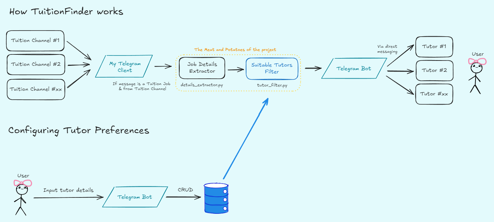
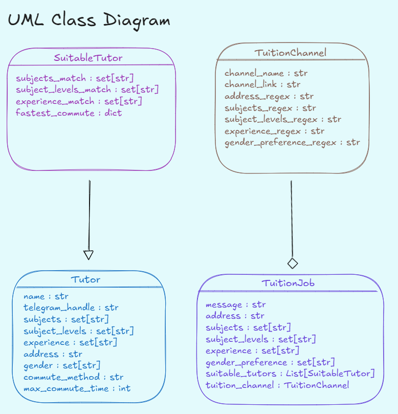
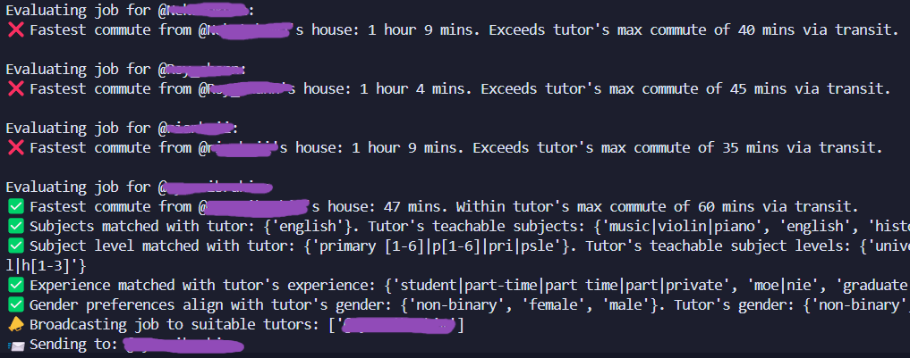
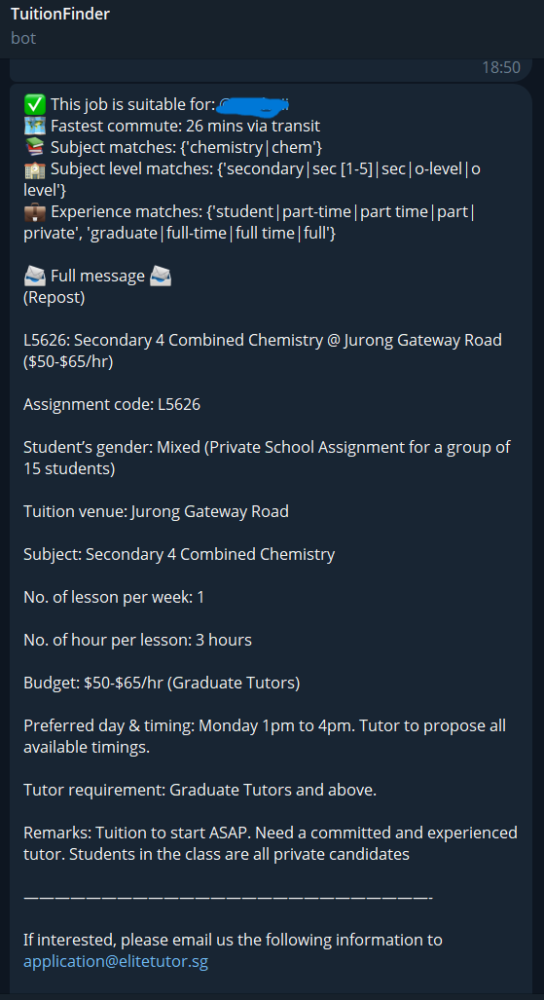
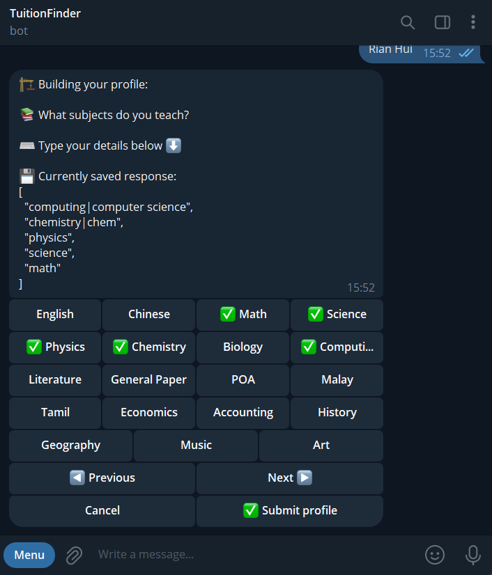
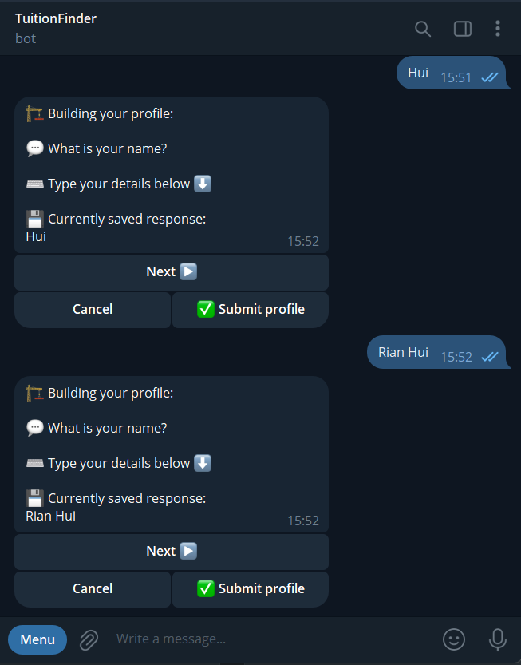

# TuitionFinder
TuitionFinder is a personal project that helps me filter private tuition jobs from several Telegram tuition job channels. 
It's made in Python using the [Telethon Library](https://docs.telethon.dev/en/stable/index.html), a wrapper for the Telegram API.

# How it works
## Program flow


1. Using my own Telegram client, I subscribe to several popular tuition job channels in Singapore.
2. I then extract job details from incoming messages into a structured class object, from which I can perform filtering based on tutor details.
3. For each intercepted job message, a list of suitable tutors is generated, where my TuitionFinder bot will send a message to all of them via direct messaging, akin to a personal scouting agent of some sort.

## Job filtering


This TuitionFinder bot takes the following parameters for job filtering:
- Address
- Subjects taught
- Subject levels taught
- Tutor Expertise
- Gender

If a match of found, the job is forwarded to the tutor




## Storing user data & bot interaction states

Using [PysonDB](https://github.com/pysonDB/pysonDB), I locally store all tutor information and temporary session variables for bot interactions. 

PysonDB has been very simple and lightweight to use, which was great for a small project such as this 😊.

# User Interaction

Users can enter their tutor profile via interacting with the bot menu, which include toggle and navigation buttons.





# Running your own instance

If you'd like to run your own instance of this, be sure to grab your own Google API Key, as the script uses Google's Directions API for tutor-student commute duration,

Additionally, this'll require your own pair of [Telegram API key and hash](https://core.telegram.org/api/obtaining_api_id), as well as a [bot token](https://core.telegram.org/bots/tutorial).

```
pip install -r requirements.txt
python main.py
```

# A bit more about the project's inception

This project was originally created for me and my mom...as we both do private tutoring to keep the lights up at home 😅.

I was rather annoyed at the act of scrolling through hundreds of tuition job application messages, repeating this process for 5+ tuition channels, and one day figured "hey, could I code something for this?", and thus this project came about.

## Calling all Singapore-based private tutors!

> I'd love to see if this bot could assist you in finding students! You could give this a try [@TuitionFinderBot](https://t.me/TuitionFinderBot), and let me know at rianhuimo@gmail.com about your experience with it!
> ~ Rian 🪴


